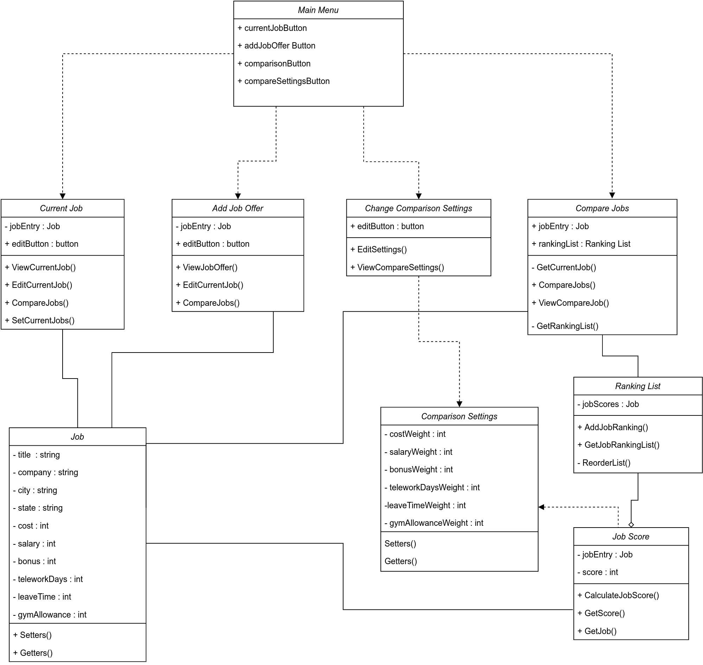
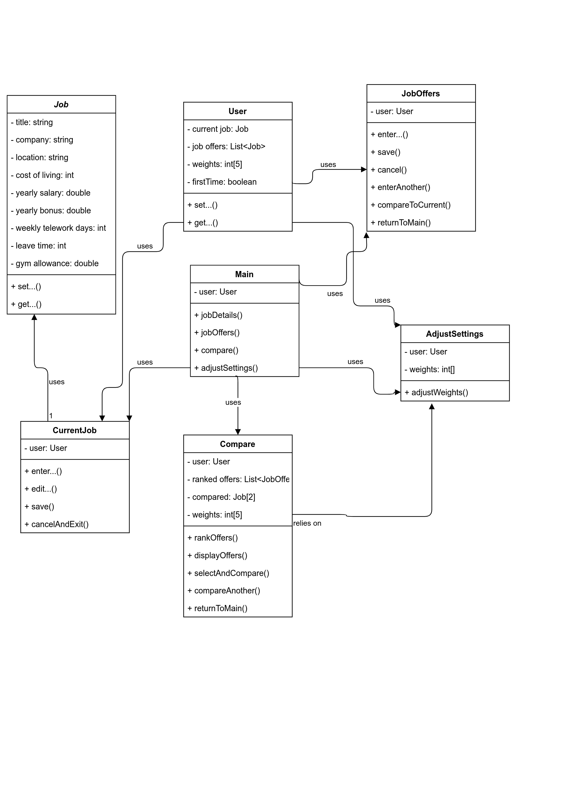
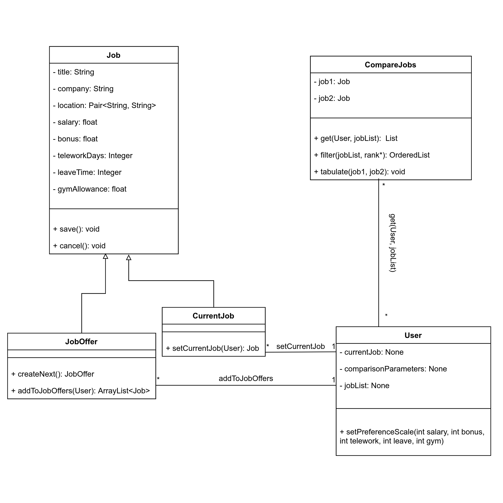
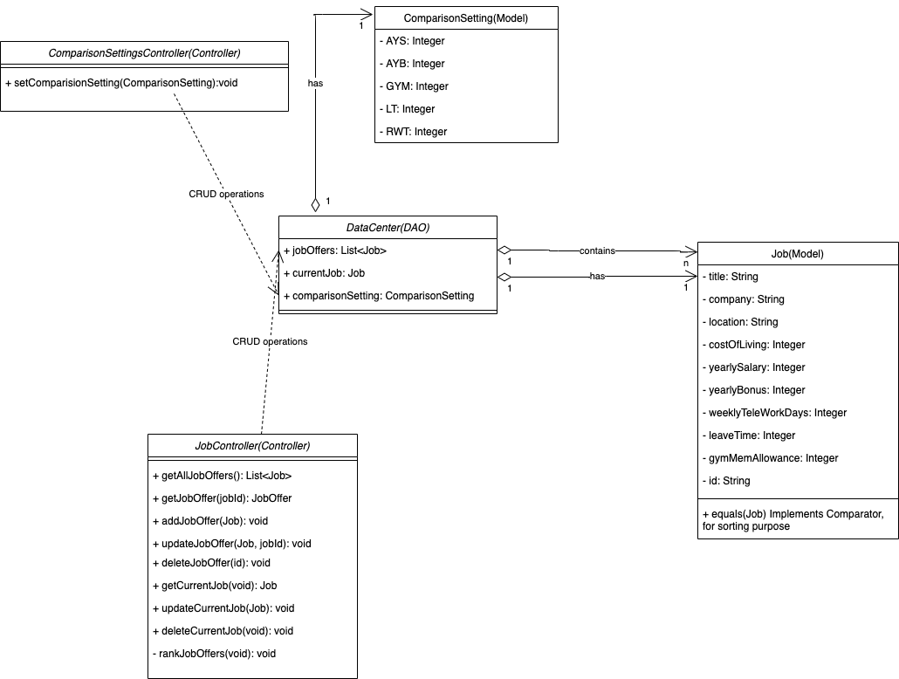

# Individual Designs

## Design 1 (Demitri Jerow)

### Main Pros
- Design covers most use cases
- Well organized / detailed

### Main Cons
- Mixed class design between model and UI controllers
- More detail on link/operations between classes and cardinality to the diagram
- Adding parameters for methods between classes

## Design 2 (Jane Agim)

### Main Pros
- Aptly named classes
- Easy to infer the connections between classes
- Classes contain relevant, well-defined attributes

### Main Cons
- Couples UI actions to model type considerations
- Class operations and relationships could be refined or specialized for clarity or a better understanding of class interactions  

## Design 3 (Xiangtian Gu)

### Main Pros
- Has explicit data center (DAO) object
- Job class has explicit ID
- Specifies data to be passed in methods
- Very concise diagram and easy to understand

### Main Cons
- Variables are publicly accessible in ComparisonSettings and Job classes

## Design 4 (Nikou Zarrabi)

### Main Pros
- Orients job details around user concept
- Requirements from assignment are clearly visible in diagram

### Main Cons
- Mixed class design between model and UI controllers
- Does not specify methods to cover full set of interactions needed to support workflow

# Team Design

As a result of our team discussion, we selected Design 3 (Xiangtian's Design) as our potential team design.

## Main Commonalities

- Each design contains a single class that holds all the attributes for the Job object.
- Job offers are represented as a List.
- Each design is clear, organized and easy to understand.

## Main Differences

- Data storage: a User object was present in the designs of two team members (cagim3 and nzarrabi6) as a method of data storage, in comparison to the data center used in the final design.
- UI: UI classes were present in two of the individual designs (cagim3 and nzarrabi6), and were absent in the designs of the other two team members (xgu34 and djerow3). Since xgu34's design was chosen to be the final design, the UI classes are also absent from the team design.
- Entry Point: three team members (cagim3, nzarrabi6, and djerow3) used a variation of a "Main" class to represent the entry point to the system. This was omitted from the final design.

## Justification
 First, it should be noted that all of the designs showed signs of high quality work and effort. We felt that all designs satisfied the basic requirements of the application.
 However, some diagrams seemed to contain extraneous information, such as GUI-specific classes, setters/getter operations or even attempted database support layers.

After rereading the assignment instructions,  

>Please note that not every requirement must be fully and directly represented in your design. For instance, at this level of detail, you do not have to show any purely GUI-specific classes.

it became clear that this information did not need to be directly represented in the UML design.

As such, the Main Menu UI in Design 2 was omitted from the final cut.

In consideration of Designs 2 and 4, the User classes are present in order to store information about the current job and job offers.  
Since George P. Burdell is the only user of the simple, single-user job offer comparison app, we made the assumption there was not a need for a user class.

Opting to find a more simplistic design, our discussion led us to consider whether Design 3 would make for a good team design.
We noted that Design 3 replaces the User class present in Designs 2 and 4, with the DataCenter(DAO), equipped with CRUD operations.

The level of detail provided in this section is appropriate, according to the Assignment 5 "Details" section:
> Similarly, any database support layer may be left out, if it is purely doing persistence tasks (simple CRUD only) on data and collections already fully represented in the design.  

After some discussion, we only made one suggestion to update the design, by changing the public attributes found in ComparisonSettings and Job models to private attributes. We were hard-pressed to find any other flaws in the design and found that the classes are detailed, contain all appropriate attributes and operations to meet the App Requirements, and all relationships are well-defined to cover all base cases.

# Summary
Through our team discussion, we were able to treat Assignment 5 like a proper lesson in UML design, teamwork and most importantly, as a benchmark for how to properly follow instructions to complete an assignment or project.

## UML Design

- UI classes should not be included in a UML class diagram.
- Visibility of attributes is not quite as important in smaller projects.
- Walking through test cases can help improve understanding of the UML diagram's process.
- The simplicity of the design depends on the level of detail provided

## Teamwork

It was hard to tell from Deliverable 0, what kind of team we would form. Through this deliverable, it was clear that everyone put forth their best effort from the beginning.

 We quickly convened, uploaded our individual assignments as soon as circumstances permitted and had an in depth meeting to ensure that every aspect of the assignment was properly handled.
 The division of tasks facilitated our work quite well and we were all able to work from distance, even navigating the difficulties that arise from different timezones.

  The importance of the Git exercises from earlier in the semester were highlighted as well, through this exercise.

Were it not for the agreeableness and combined efforts of the team, coming to a consensus for the team diagram and procuring the accompanying documents, results would have been disastrous.

## Final Remarks
While some of us UML beginners struggled with Assignment 5, it seemed apparent that a lot of the assignment details could have been studied in more detail. For example, it was not until this team meeting that some of us realized what CRUD meant, in the context of this assignment. We also discussed the lecture videos and noticed we had different interpretations of some UML conventions. In addition, since the line between UI UML and backend UML is not very clear in the instruction, we eventually chose the UML just for backend API to make it clear and useful for the final implementation. Finally, the more experienced team members gave tips on how to properly use Git and other technology to facilitate proper collaboration.
