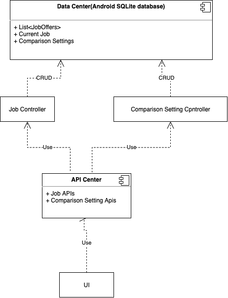
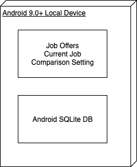
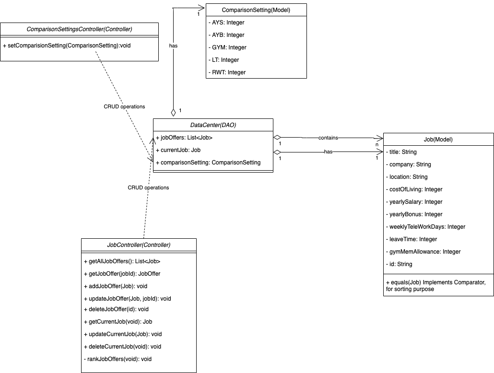
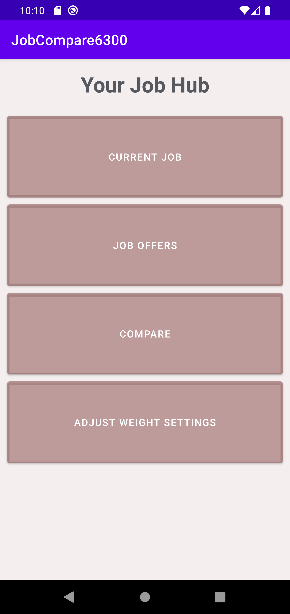
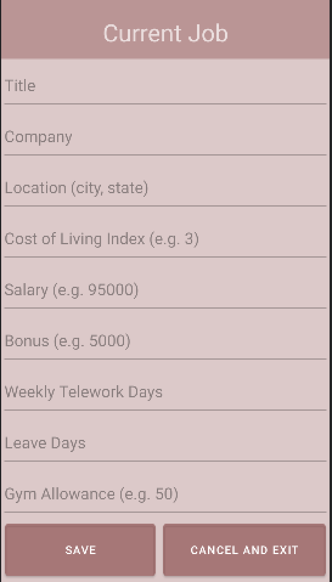
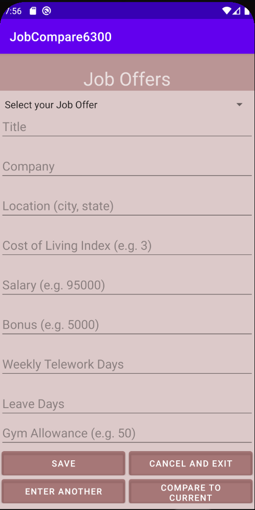
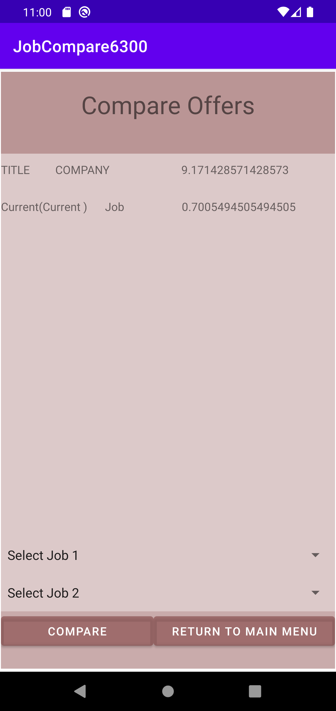
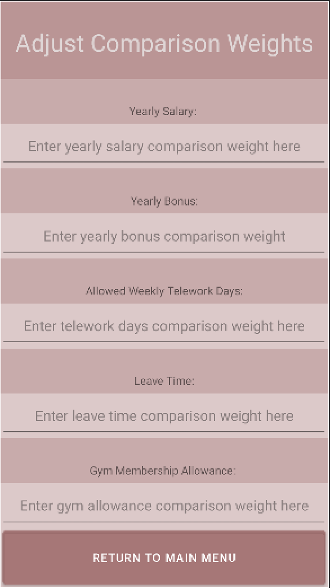
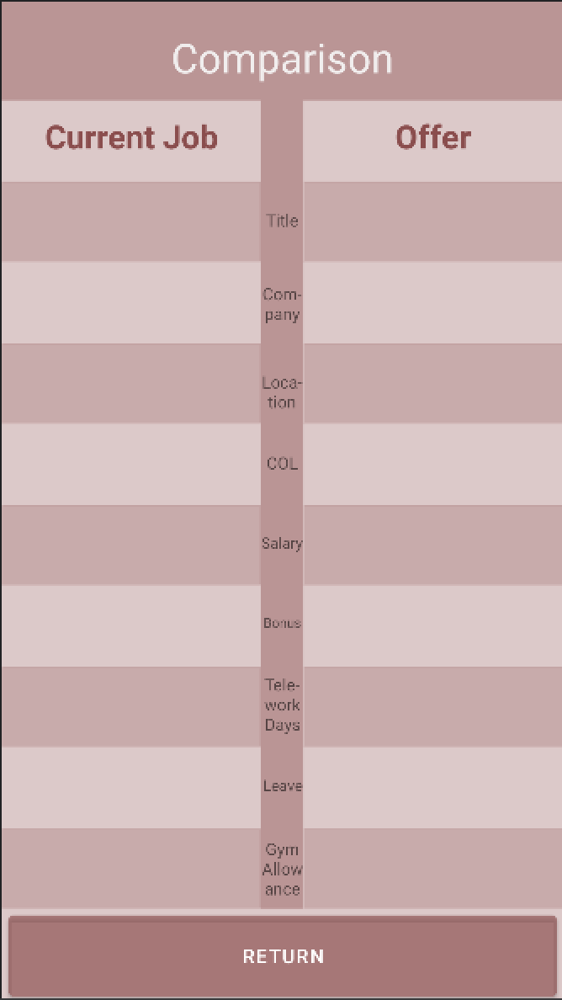

# Design Document

**Author**: Team 014

## 1 Design Considerations

### 1.1 Assumptions

In the creation of this app, we assume:

- The app is implemented on the Android platform
- The app only serves a single user (George P. Burdell, our fellow classmate)
- The app supports an API level of 29 or higher
- Network connection is not required for application functionality
- The app does not need multiple device log in
- Processing time/Multi threading do not need to be included into the design consideration

### 1.2 Constraints

- Application state shall persist between runs. The application must provide a persistency layer in order to persist data locally.
- App must be able to handle at least 100 job offers

### 1.3 System Environment

- Platform: Android SDK
- OS/API Level: Android 10.0(Q) / API 29

## 2 Architectural Design

### 2.1 Component Diagram

All UI actions will be done by calling apis inside the API center, which further interacts with Job Controller and ComparasonSetting Controller. Job Controller and ComparasonSetting Controller are responsible for CRUD actions with
Android's internal SQLite Database.

### 2.2 Deployment Diagram

In this project, all components will be stored inside Android SQLite database, no external database would be used.

## 3 Low-Level Design

All UI actions will be done by calling apis inside the API center, which interacts with Job Controller and ComparasonSetting Controller. Job Controller contains all job offfer related actions while ComparasonSetting Controller contains any actions realted to comparison settings. Job Controller and ComparasonSetting Controller will further interact with with Android's internal SQLite Database for any CRUD actions as needed.

### 3.1 Class Diagram

## 4 User Interface Design

### Main Menu

### Current Job

### Job Offers

### Compare Offers

### Adjust Weights

### Comparison Chart

