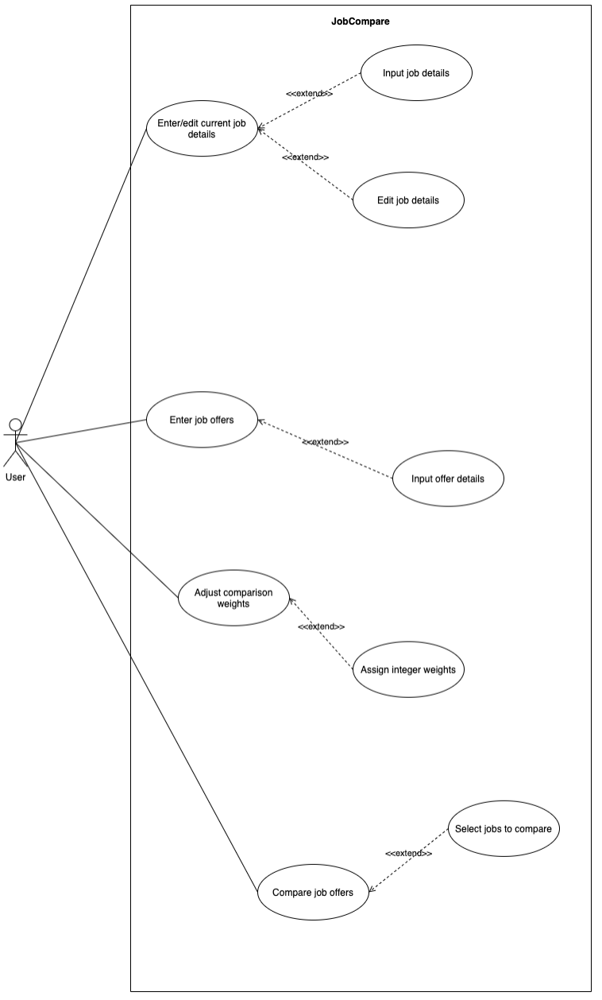

# Use Case Model

**Author**: Team 014 - cagim3

## 1 Use Case Diagram

## 2 Use Case Descriptions

#### Enter/edit current job details -> Input job details
- Requirements: This use case allows the user to input their current job details and gives them the option to either save or cancel the input.
- Pre-conditions: No current job details saved.
- Post-conditions: Current job details are either saved or the user is returned to the main menu without saving.
- Scenarios: The user clicks the "current job" button in the main menu, inputs the details of their current job, and chooses to either save the details and return to the main menu or cancel the input and return to the main menu.

#### Enter/edit current job details -> Edit job details
- Requirements: This use case allows the user to edit job details entered prior, and gives them the option to either save or cancel the input.
- Pre-conditions: Current job details are already saved.
- Post-conditions: Edited current job details are either saved or no changes are made.
- Scenarios: The user clicks the "current job" button in the main menu, edits the details of their current job, and clicks the save or the cancel button. Both of these return the user to the main menu.

#### Enter job offers -> Input offer details
- Requirements: This use case allows the user to input their job details and gives them the option to either save the offer, cancel input, enter another offer, clear the form, or compare the saved offer to the current job.
- Pre-conditions: N/A
- Post-conditions: A job offer has been added to the user's list of offers or no changes are made.
- Scenario 1: The user clicks the "job offers" button in the main menu, inputs the details of the offer, and clicks the save button. The job offer is saved and the user is returned to the main menu.
- Scenario 2: The user clicks the "job offers" button in the main menu, inputs the details of the offer, and clicks the cancel button. The job offer is not saved and the user is returned to the main menu.
- Scenario 3: The user clicks the "job offers" button in the main menu, inputs the details of the offer, and clicks the "enter another" button. The job offer is saved and the form is cleared to allow for another offer to be inputted.
- Scenario 4: The user clicks the "job offers" button in the main menu, inputs the details of the offer, and clicks the clear button. The job offer is not saved and the form is cleared.
- Scenario 5: The user clicks the "job offers" button in the main menu, inputs the details of the offer, and clicks the "enter another" button. The job offer is saved and the form is cleared. The user then clicks the "compare to current" button and is taken to the comparison chart UI where the details of their current offer is displayed alongside the most recently saved offer.

#### Adjust comparison weights
- Requirements: This use case allows the user to adjust the comparison weights and return to the main menu upon completion.
- Pre-conditions: The weights of each field is set to 1.
- Post-conditions: New comparison weights are saved or no changes are made.
- Scenario: The user clicks the "adjust weight settings" button in the main menu, inputs their desired weights into the appropriate field or makes no changes. They then click the "return to main menu" button and the weights are saved. 

#### Compare job offers
- Requirements: This use case allows the user to compare two job offers from a list of job offers displayed and either return to the main menu or compare another upon completion.
- Pre-conditions: At least 2 job offers have been saved, or at least 1 job offer and a current job has been saved.
- Post-conditions: The user is shown a table displaying the attributes of each chosen job.
- Scenario 1: The user clicks the "compare" button in the main menu, is shown the list of job offers, selects two to compare, and then clicks the "compare" button. The user is then shown the comparison chart UI with the details of the two jobs present. The user then clicks the "return to main menu" button and is returned to the main menu.
- Scenario 2: The user clicks the "compare" button in the main menu, is shown the list of job offers, selects two to compare, and then clicks the "compare" button. The user is then shown the comparison chart UI with the details of the two jobs present. The user then clicks the "compare another" button and is returned to the previous UI.
