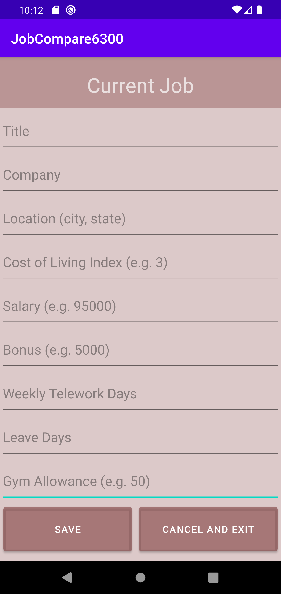
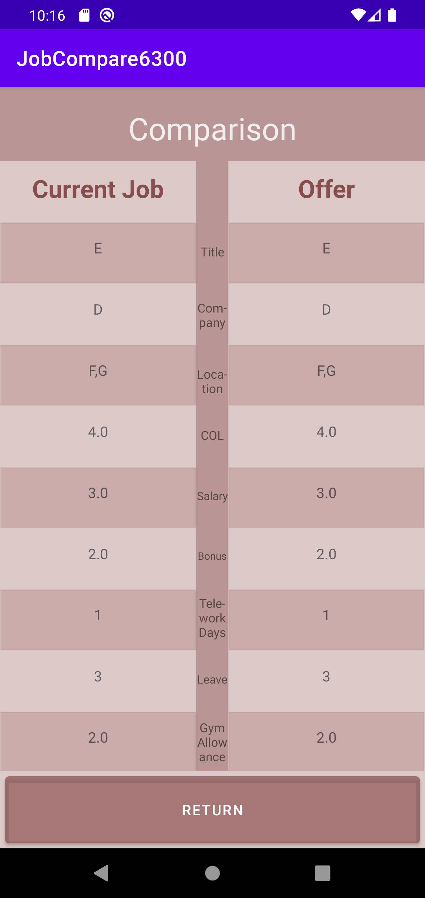
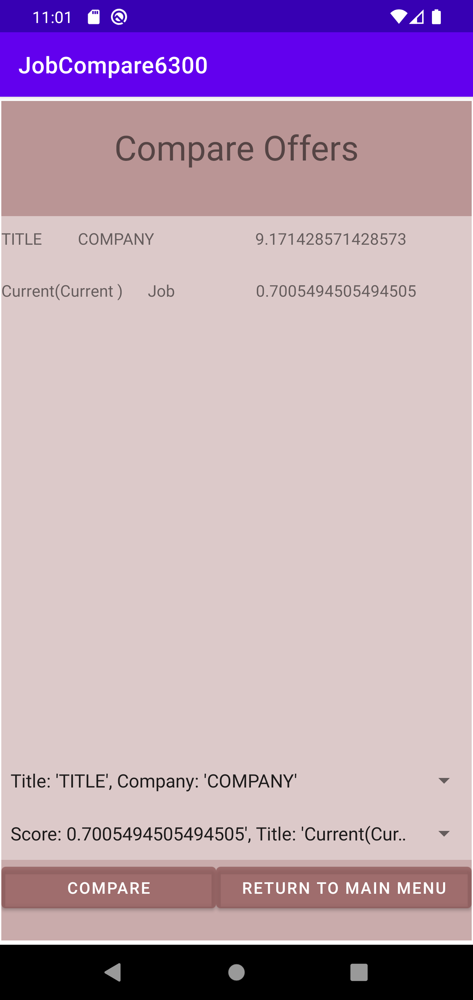
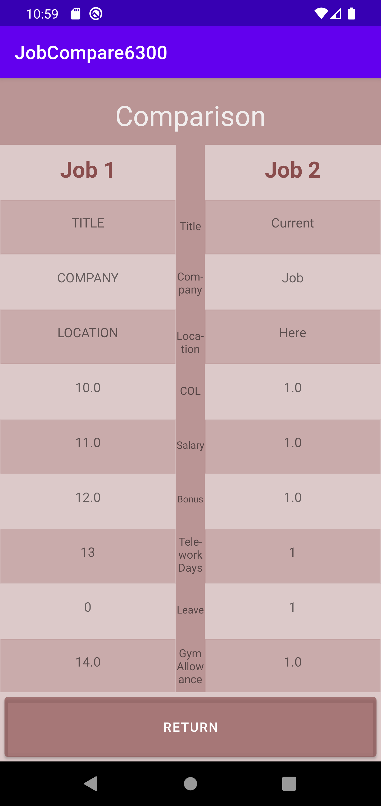
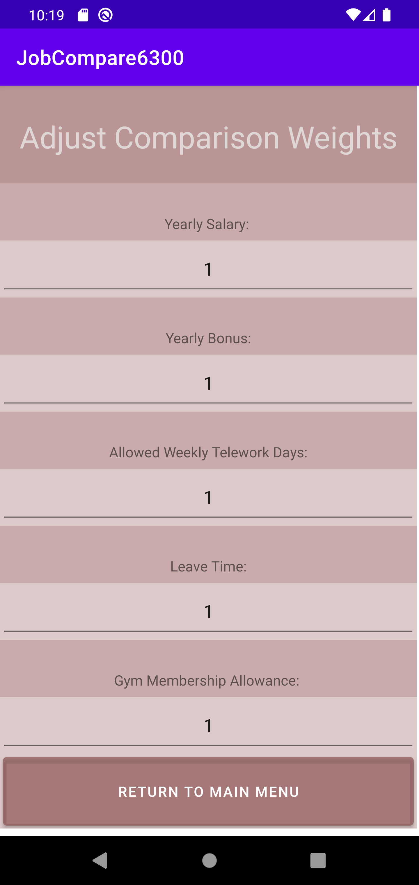
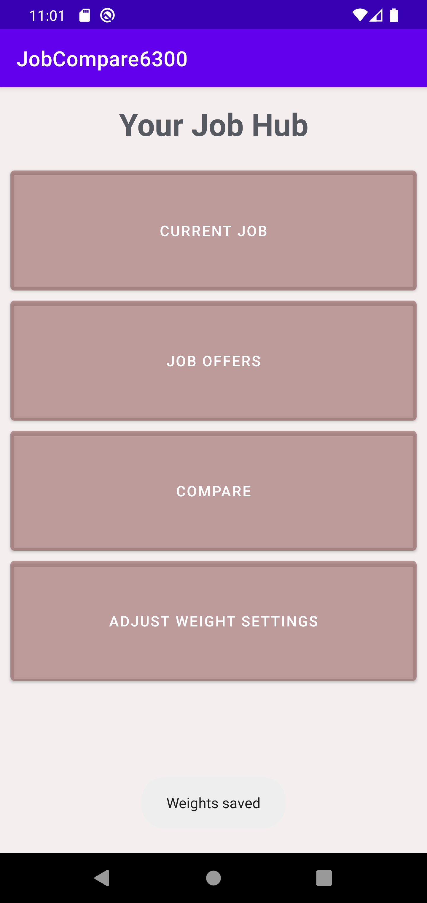

# User Manual

### This single-user job comparison application will allow George P. Burdell to compare the benefits of job offers he has received by providing methods to ranks the inputted offers, compare the offers side-by-side, and adjust the weight each benefit assumes.

## Main Menu

This page contains four buttons, Current Job, Job Offers, Compare, and Adjust Weight Settings that once clicked, allow the user to either enter or edit their current job, enter job offers, compare two job offers once selected, or adjust the weight each benefit is given in the job scoring calculation.

## Current Job

This page contains editable fields that allow the user to input the details of their current job if none is present, or edit the details of their current job if one is present. Clicking the "save" button saves the information inputted or edited and takes the user back to the main menu. Clicking the "cancel and exit" button does not save the information inputted, and takes the user back to the main menu.

## Job Offers

This page also contains editable fields that allow the user to input the details of each offer received. The user has the option to save the details inputted by clicking the "save and exit" button, cancel the input by clicking the "cancel and exit" button, save the current details and clear the form to enter another offer by clicking the "enter another" button, or compare the current job (if inputted prior) to the most recently saved offer (by switching to a chart that displays the details of both jobs).

The toggle menu "Select your Job Offer" allows you to recall previously saved Job Offers to Compare to the Current Job.
Note that while you are allowed to select your current job as a job offer, clicking "Save" will merely update your existing job in our Jobs database. 

When selecting the Compare to Current job, you will be provided with this activity screen. In this case, selecting current job in the Spinner dropdown menu and pressing compare to current will present you with a redundant/duplicate comparison.

## Compare

This page allows the user to select two jobs to compare and upon clicking the "compare" button, opens the same Comparison activity, found above in the Job Offers activity, and displays the details of the two jobs in a chart.
 The current job is identified after the job title in parenthesis (Current).

Step 1) Select Jobs  

The compare feature allows you to view a table of all of your job offers, with the ability to select two jobs using the two drop down menus provided.

Step 2) Compare  

Now that the two jobs are selected, we can press the "Compare" button to compare both jobs.

Step 3) Behold  

To exit this comparison activity press on "Return" to revisit the Main Menu.

## Adjust Weight Settings

This page allows the user to adjust the weights of the Yearly Salary, Yearly Bonus, Allowed Weekly Telework Days, Leave Time, and Gym Membership Allowance attributes in the job scoring calculation.

You may choose to edit these weights. To do so, simply click on the weight's text field and edit the integer to your preferred integer weight.

To save these parameters, hit the "Return To Main Menu" button. Once on the menu, you will be shown a brief pop up text with the following success message:

This indicates that the weights have saved properly. No further input is required from the user. You may revisit this menu as need be, if you wish to adjust your Comparison Settings once again.
